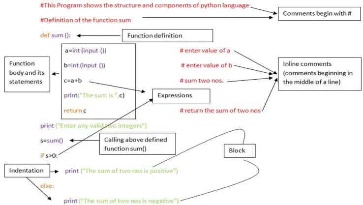
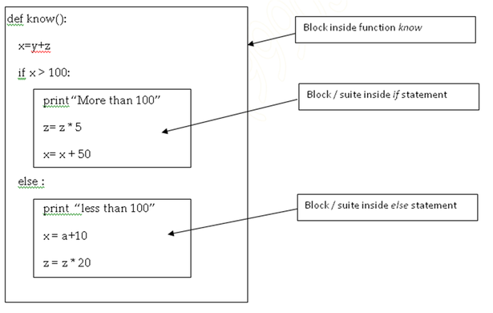

==============
Python Basic
==============

Learning Objectives:
====================

At the end of this chapter the students will be able to understand:

* :ref:`interactive-mode`
* :ref:`script-mode`
* :ref:`Python-Scripts-Using-the-Command-Line`
* :ref:`Structure-of-the-Python-Program`
* :ref:`Variables`
* :ref:`Input-and-Output`

.. index::
   single: Interactive Mode

.. _interactive-mode:

Interactive Mode
=================

Here, when we type Python statement, interpreter displays the result(s) immediately. That means, when we type Python
expression / statement / command after the prompt (>>>), the Python immediately responses with the
output of it::
   
       Python 3.x.y
       [GCC 4.x] on linux
       Type "help", "copyright", "credits" or "license" for more information.
       >>>3+4
       7

.. index::
   single: Script Mode

.. _script-mode:

Script Mode
============

In script mode, we type Python program in a file and then use interpreter to execute the content of the file. Working in interactive mode is convenient for beginners and for testing small pieces of code, as one can test them immediately. But for coding of more than few lines, we should always save our code so that it can be **modified and reused**.

.. code-block:: python
    :caption: sum.py

    num1 = int(input("Enter first Number :"))
    num2 = int(input("Enter Second Number: "))
    sum = num1+num2
    print("Sum of two number is :", sum)

.. container:: output

    | **OUTPUT :**
    | Enter first Number   :  5
    | Enter Second Number  :  8
    | Sum of two number is :  13

.. note::

        | Python, in `interactive mode`_, is good enough to learn, experiment or explore, but its only drawback is that we cannot save the statements and have to retype all the statements once again to re-run them.

.. _Python-Scripts-Using-the-Command-Line:

Python Scripts Using the Command-Line
======================================

.. code-block:: 
    :caption: shell

    $ python sum.py
    Hello World!

**Or**

.. code-block::
    :caption: shell

    $ sum.py
    Hello World!

*If this doesn’t work right, maybe you’ll need to check your system PATH, your Python installation, the way you created the sum.py script, the place where you saved it, and so on.*

Redirecting the Output
-----------------------

Sometimes it’s useful to save the output of a script for later analysis. Here’s how you can do that:

.. code-block::
    :caption: shell

    $ sum.py > output.txt
    Hello World!

if you want to add the output of consecutive executions to the end of output.txt, then you must use two angle brackets (>>) instead of one, just like this:

.. code-block::
    :caption: shell

    $ sum.py >> output.txt
    Hello World!

.. _Structure-of-the-Python-Program:

Structure of the Python’s Program
===================================

    Structure of the Python’s Program

So the above sample program contains various components:

1. :ref:`Expressions`
2. :ref:`Statements`
3. :ref:`Comments`
4. :ref:`Function`
5. :ref:`Blocks-and-indentation`

.. index::
   single: Expressions

.. _Expressions:

Expressions:
----------------

An expression is any legal combination of symbols that represents a value.

For example
::

    c=a+b
    s>0

.. index::
   single: Statement

.. _Statements:

Statement:
--------------

A statement is a programming instruction that does something.

For example
::

    print ("The sum is:",c)
    if s>0:

.. index::
   single: Comments

.. _Comments:

Comments:
------------

Comments are any text to the right of the # symbol and are mainly useful as notes for the reader of the program.

For example:
::

    print('Hello World') # Note that print is a function

or:
::

    # Note that print is a function

    print('Hello World')

**Two types of comments:**

1. *Single line Comment:* # marks start of single line comment that must not be inside a string literal.    Example
::

    def getline():

    return sys.stdin.readline()    # Get one line and return it

2. *Multi Line Comment:* Comments can be break up into multiple lines by inserting a multiline string with ”’as the delimiter one each end.
::

    def getline():

    return sys.stdin.readline()            '''this function

    gets one line

    and returns it'''

.. index::
   single: Function

.. _Function:

Function:
--------------

A function is a group of statements that exist within a program for the purpose of performing a specific task and it can be reused (executed again) by specifying its name in the program, where needed.

**How to define and Call a function in python:**

A user-defined Python function is created or defined by the def statement followed by the function name and parentheses () as shown in the syntax given below:

Syntax:
::

    def function_Name (comma_separated_list_of_parameters):

        statements

        …

        …

.. note:: Statement below def begin with four spaces. This is called indentation. It is a requirement of Python that the code following a colon must be indented.

::

    def sum ():   #function definition of sum()

    a=int (input ())

    b=int (input ())

    c=a+b

    print("The sum is ",c)

    return c

    print ("Enter any valid two integers")

    s=sum()     # Calling above defined function sum()

.. index::
   single: Block and Indentation

.. _Blocks-and-indentation:

Block and Indentation:
--------------------------

A group of statements which are part of another statement or a function are called block or code – block or suite in Python.

Consider the following Example:
::

    if n1<n2:

    Tmp =n1

    n1=n2

    n2=Tmp

    print "I Understand Block"

*One of the most remarkable difference between Python and other most common programming  languages like C, C++, C#, Java will be encounter programmer’s is that in Python indentation is  very  important and there are no braces to indicate blocks of code for class and function definitions  or  flow control. There are no end/begin delimiters like {}.*

Whitespace is important in Python. Actually, whitespace at the beginning of the line is important. This is called indentation. Leading whitespace (spaces and tabs) at the beginning of the logical line is used to determine the indentation level of the logical line, which in turn is used to determine the grouping of statements.

Python uses indentation to create blocks of code. Statements at same indentation level are part of same block / suite.

Statements requiring suite / code bloc have a colon (:) at their end.

You cannot unnecessarily indent a statement; Python will raise error for that.

Another Example:

.. index::
   single: Variables

.. _Variables:

Variables
===========

Variables are exactly what the name implies – their value can vary, i.e., you can store anything using a variable. Variables are just parts of your computer’s memory where you store some information.

Named labels, whose values can be manipulated during program run, are called Variables.

Creating a Variable:
---------------------

Python variables are created by assigning value of desired type to them, example: to create a numeric variable, assign a numeric value to variable_name; to create a sting variable, assign a string value to variable_name and so on.

Example:
::

    X=10.8   # variable created of numeric (floating point) type

    Y = 90   # variable created of numeric (integer) type

    Name = "My Name"   # variable created of string type

Multiple Assignments:
----------------------

Assigning same value to multiple variables:
::

    x = y = z = 100

It will assign value 100 to all three variables x, y and z.

Assigning multiple value to multiple variables
::

    p, q, r = 10, 20, 30

It will assign the value order wise that is value 10 assign to variable p, value 20 assign to variable q and value 30 assign to variable r.

**IMPORTANT NOTE:**

A variable is defined only when you assign some value to it. Using an undefined variable in an expression / statement cause error.

Example:
::

    print (a)  # Error name 'a' not defined

    a = 20                                   

    print (a)

correct code:
::

    a=10

    print (a)

    a = 20

    print a)

.. seealso::

    To learn more about variable assignments see.. :doc:`VariableAssignment`

.. _Input-and-Output:

Input and Output
==================

.. function:: sep()

The ``end`` parameter is used to append any string at the end of the output of the print statement in python.

By default, the print method ends with a ``newline``.

::

    print("Studytonight",)
    print("is awesome")

    print("Studytonight", end= "\n")
    print("is awesome")

.. container:: outputs

    | **OUTPUT :**
    | Studytonight
    | is awesome
    | Studytonight
    | is awesome

::

    print("Studytonight", end=' ')
    print("is awesome")

.. container:: outputs

    | **OUTPUT :**   
    | Studytonight is awesome

.. function:: end()

The arguments passed to the program can be separated by different values. The default value for sep is whitespace. 

::

    print("Study", "tonight", sep = '')
    print("Study", "tonight", sep = ' & ')

.. container:: outputs

    | **OUTPUT :**
    | Studytonight
    | Study & tonight

.. note:: The :func:`sep` parameter, used in conjunction with the :func:`end` parameter is generally used in production code to print data in a readable fashion.

::

    print("Studytonight","has","been","created","for", sep = " _ ", end=" _STUDENTS")

.. container:: outputs

    | **OUTPUT :**
    | Studytonight _ has _ been _ created _ for _STUDENTS
