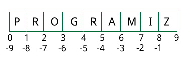

================
Python Strings
================

What is String in Python?
============================

A string is a sequence of characters.

A character is simply a symbol. For example, the English language has 26 characters.

Computers do not deal with characters, they deal with numbers (binary). Even though you may see characters on your screen, internally it is stored and manipulated as a combination of 0s and 1s.

This conversion of character to a number is called encoding, and the reverse process is decoding. ``ASCII`` and ``Unicode`` are some of the popular encodings used.

In Python, a string is a sequence of Unicode characters. Unicode was introduced to include every character in all languages and bring uniformity in encoding.

How to create a string in Python?
====================================

Strings can be created by enclosing characters inside a single quote or double-quotes. Even triple quotes can be used in Python but generally used to represent multiline strings and docstrings.
::

    my_string = 'Hello'
    print(my_string)

    my_string = "Hello"
    print(my_string)

    my_string = '''Hello'''
    print(my_string)

    my_string = """Hello, welcome to
            the world of Python"""
    print(my_string)

When you run the program, the output will be:

.. container:: outputs

    | **OUTPUT :**
    | Hello
    | Hello
    | Hello
    | Hello, welcome to
    |          the world of Python

How to access characters in a string?
========================================

We can access individual characters using indexing and a range of characters using slicing. Index starts from 0. Trying to access a character out of index range will raise an ``IndexError``. **The index must be an integer. We can't use floats or other types**, this will result into TypeError.

Python allows negative indexing for its sequences.

**The index of -1 refers to the last item, -2 to the second last item and so on. We can access a range of items in a string by using the slicing operator :(colon).**
::

    str = 'programiz'
    print('str = ', str)

    print('str[0] = ', str[0])
    print('str[-1] = ', str[-1])
    print('str[1:5] = ', str[1:5])
    print('str[5:-2] = ', str[5:-2])

When we run the above program, we get the following output:

.. container:: outputs

    | **OUTPUT :**
    | str =  programiz
    | str[0] =  p
    | str[-1] =  z
    | str[1:5] =  rogr
    | str[5:-2] =  am

If we try to access an index out of the range or use numbers other than an integer, we will get errors.
::

    >>> my_string[15]  
    ...
    IndexError: string index out of range

    >>> my_string[1.5] 
    ...
    TypeError: string indices must be integers

Slicing can be best visualized by considering the index to be between the elements as shown below.

If we want to access a range, we need the index that will slice the portion from the string.

    String Slicing in Python

How to change or delete a string?
====================================

Strings are immutable. This means that elements of a string cannot be changed once they have been assigned. We can simply reassign different strings to the same name.
::

    >>> my_string = 'programiz'
    >>> my_string[5] = 'a'
    ...
    TypeError: 'str' object does not support item assignment
    >>> my_string = 'Python'
    >>> my_string
    'Python'

We cannot delete or remove characters from a string. But deleting the string entirely is possible using the **del** keyword.
::

    >>> del my_string[1]
    ...
    TypeError: 'str' object doesn't support item deletion
    >>> del my_string
    >>> my_string
    ...
    NameError: name 'my_string' is not defined

Python String Operations
===========================

There are many operations that can be performed with strings which makes it one of the most used data types in Python.

Concatenation of Two or More Strings
----------------------------------------

Joining of two or more strings into a single one is called concatenation.

The ``+`` operator does this in Python. Simply writing two string literals together also concatenates them.

The ``*`` operator can be used to repeat the string for a given number of times.

::

    str1 = 'Hello'
    str2 ='World!'

    print('str1 + str2 = ', str1 + str2)
    print('str1 * 3 =', str1 * 3)

When we run the above program, we get the following output:

.. container:: outputs

    | **OUTPUT :**
    | str1 + str2 =  HelloWorld!
    | str1 * 3 = HelloHelloHello

Writing two string literals together also concatenates them like + operator.

If we want to concatenate strings in different lines, we can use parentheses.
::

    >>> 
    >>> 'Hello ''World!'
    'Hello World!'

    >>> 
    >>> s = ('Hello '
    ...      'World')
    >>> s
    'Hello World'

Iterating Through a string
-----------------------------

We can iterate through a string using a for loop. Here is an example to count the number of **'l's** in a string.
::

    count = 0
    for letter in 'Hello World':
        if(letter == 'l'):
            count += 1
    print(count,'letters found')

When we run the above program, we get the following output:

.. container:: outputs

    | **OUTPUT :**
    | 3 letters found

String Membership Test
----------------------------

We can test if a substring exists within a string or not, using the keyword in.
::

    >>> 'a' in 'program'
    True
    >>> 'at' not in 'battle'
    False

Built-in functions to Work with Python
-----------------------------------------

Various built-in functions that work with sequence work with strings as well.

Some of the commonly used ones are ``enumerate()`` and ``len()``. The enumerate() function returns an enumerate object. It contains the index and value of all the items in the string as pairs. This can be useful for iteration.

Similarly, ``len()`` returns the length (number of characters) of the string.
::

    str = 'cold'

    list_enumerate = list(enumerate(str))
    print('list(enumerate(str) = ', list_enumerate)

    print('len(str) = ', len(str))

When we run the above program, we get the following output:

.. container:: outputs

    | **OUTPUT :**
    | list(enumerate(str) =  [(0, 'c'), (1, 'o'), (2, 'l'), (3, 'd')]
    | len(str) =  4

Python String Formatting
===========================

.. seealso:: To learn about String Formatting see :doc:`StringFormating`

Common Python String Methods
=================================

There are numerous methods available with the string object. The format() method that we mentioned above is one of them. Some of the commonly used methods are **lower(), upper(), join(), split(), find(), replace()** etc. Here is a complete list of all the built-in methods to work with strings in Python.

::

    >>> "PrOgRaMiZ".lower()
    'programiz'
    >>> "PrOgRaMiZ".upper()
    'PROGRAMIZ'
    >>> "This will split all words into a list".split()
    ['This', 'will', 'split', 'all', 'words', 'into', 'a', 'list']
    >>> ' '.join(['This', 'will', 'join', 'all', 'words', 'into', 'a', 'string'])
    'This will join all words into a string'
    >>> 'Happy New Year'.find('ew')
    7
    >>> 'Happy New Year'.replace('Happy','Brilliant')
    'Brilliant New Year'

String Methods
=================

Python has a set of built-in methods that you can use on strings.

.. note:: All string methods returns new values. They do not change the original string.

.. csv-table::
   :header: Method,Description
   :widths: 20, 80
   :file: csv/StringMethod.csv
   :align: center 