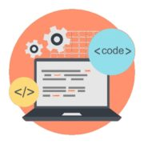

=====================
Python Introduction
=====================

Introduction
================

* Python is an **interpreted**, **high-level**, general-purpose programming language. Created by Guido van Rossum and first released in 1991.

* Python is **dynamically typed** and **garbage-collected**.

* Python is **object oriented programming** language.

Python Applications
=======================

Python supports **cross-platform** operating systems which makes building applications with it all the more convenient. Some of the globally known applications such as **YouTube, BitTorrent, DropBox, etc**. use Python to achieve their functionality.

1. Web Development
---------------------

Python can be used to make web-applications at a rapid rate. Why is that? It is because of the frameworks Python uses to create these applications. There is common-backend logic that goes into making these frameworks and a number of libraries that can help integrate protocols such as HTTPS, FTP, SSL etc. and even help in the processing of JSON, XML, E-Mail and so much more.

**Some of the most well-known frameworks are Django, Flask, Pyramid.** Why use a framework? The security, scalability, convenience that they provide is unparalleled compared to starting the development of a website from scratch.

2. Game Development
-------------------------

Python is also used in the development of interactive games. There are libraries such as **PySoy** which is a 3D game engine supporting Python 3, **PyGame** which provides functionality and a library for game development. Games such as **Civilization-IV, Disney’s Toontown Online, Vega Strike etc.** have been built using Python.

3. Machine Learning and Artificial Intelligence
---------------------------------------------------

**Machine Learning and Artificial Intelligence** are the talks of the town as they yield the most promising careers for the future. We make the computer learn based on past experiences through the data stored or better yet, create algorithms which makes the computer learn by itself. The programming language that mostly everyone chooses? It’s Python. Why? Support for these domains with the libraries that exist already such as **Pandas, Scikit-Learn, NumPy** and so many more.

.. figure:: img/3.png
    :width: 25%
    :align: center

Learn the algorithm, use the library and you have your solution to the problem. It is that simple. But if you want to go the hardcore way, you can design your own code which yields a better solution, which still is much easier compared to other languages.

4. Data Science and Data Visualization
------------------------------------------

Data is money if you know how to extract relevant information which can help you take calculated risks and increase profits. You study the data you have, perform operations and extract the information required. Libraries such as Pandas, NumPy help you in extracting information.

You can even visualize the data libraries such as **Matplotlib, Seaborn,** which are helpful in plotting graphs and much more. This is what Python offers you to become a Data Scientist.

5. Desktop GUI
--------------------

Python can be used to program desktop applications. It provides the **Tkinter** library that can be used to develop user interfaces. There are some other useful toolkits such as the **wxWidgets, Kivy, PYQT** that can be used to create applications on several platforms.

You can start out with creating simple applications such as Calculators, To-Do apps and go ahead and create much more complicated applications.

6. Web Scraping Applications
----------------------------------

Python can be used to pull a large amount of data from websites which can then be helpful in various real-world processes such as price comparison, job listings, research and development and much more. 
Programming & Frameworks Training

.. figure:: img/6.jpg
    :width: 60%
    :align: center

Python has a library called **BeautifulSoup** which can be used to pull such data and be used accordingly. Here’s a full-fledged guide to learn Web scraping with Python.

7. Business Applications
---------------------------------

Business Applications are different than our normal applications covering domains such as **e-commerce, ERP** and many more. They require applications which are scalable, extensible and easily readable and Python provides us with all these features. Platforms such as **Tryton** can be used to develop such business applications.

8. Audio and Video Applications
-------------------------------------

.. figure:: img/8.png
    :width: 35%
    :align: center

Python can be used to develop applications that can multi-task and also output media. Video and audio applications such as **TimPlayer, Cplay** have been developed using Python libraries and they provide better stability and performance compared to other media players.

9. CAD Applications
----------------------------

**Computer-Aided Designing** is a very complicated application to make as many things have to be taken care of. Objects and their representation, functions are just the tip of the iceberg when it comes to something like this. Python makes this simple too and the most well-known application for CAD is **Fandango**.

10. Embedded Applications
----------------------------------

**Python is based on C which means that it can be used to create Embedded C software for embedded applications**. This helps us to perform higher-level applications on smaller devices which can compute Python.

The most well-known embedded application could be the **Raspberry Pi** which uses Python for its computing. It can be used as a computer or like a simple embedded board to perform high-level computations.