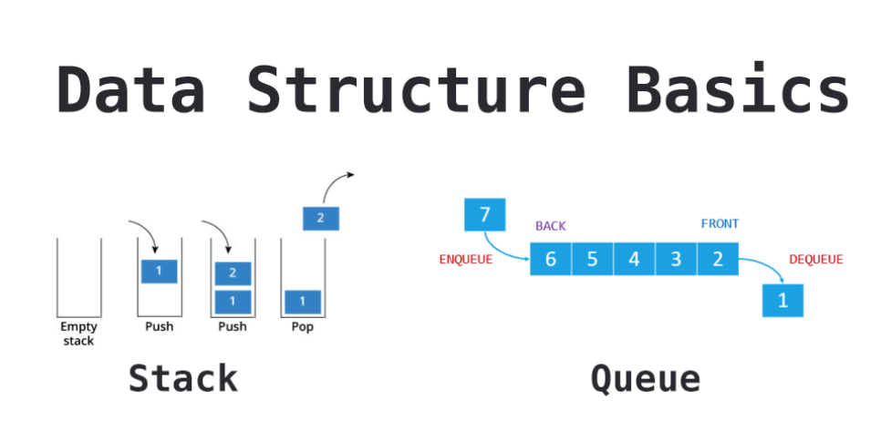

==============================
Stacks and Queues in Python
==============================

Introduction
==============

    Stacks and Queues in Python

Data structures organize storage in computers so that we can efficiently access and change data. Stacks and Queues are some of the earliest data structures defined in computer science.

Stack
=======

Stacks, like the name suggests, follow the **Last-in-First-Out (LIFO)** principle. As if stacking coins one on top of the other, the last coin we put on the top is the one that is the first to be removed from the stack later.

To implement a stack, therefore, we need two simple operations:

* ``push`` - adds an element to the top of the stack.

* ``pop`` - removes the element at the top of the stack.

Queue
========

Queues, like the name suggests, follow the **First-in-First-Out (FIFO)** principle. As if waiting in a queue for the movie tickets, the first one to stand in line is the first one to buy a ticket and enjoy the movie.

To implement a queue, therefore, we need two simple operations:

* ``enqueue`` - adds an element to the end of the queue.

* ``dequeue`` - removes the element at the beginning of the queue.

Stacks and Queues using Lists
===============================

Python's built-in List data structure comes bundled with methods to simulate both stack and queue operations.

Let's consider a **stack** of letters
---------------------------------------

::

    letters = []
    letters.append('c')
    letters.append('a')
    letters.append('t')
    letters.append('g')
    print(letters)
    last_item = letters.pop()
    print(last_item)
    print(letters)
    last_item = letters.pop()
    print(last_item)
    print(letters)

.. container:: outputs

    | **OUTPUT :**
    | ['c', 'a', 't', 'g']
    | g
    | ['c', 'a', 't']
    | t
    | ['c', 'a']

We can use the same functions to implement a Queue. The pop function optionally takes the index of the item we want to retrieve as an argument.

So we can use pop with the first index of the list i.e. 0, to get queue-like behavior.

Consider a **queue** of fruits
-----------------------------------

::

    fruits = []
    fruits.append('banana')
    fruits.append('grapes')
    fruits.append('mango')
    fruits.append('orange')
    first_item = fruits.pop(0)
    print(first_item)
    first_item = fruits.pop(0)
    print(first_item)
    print(fruits)

.. container:: outputs

    | **OUTPUT :**
    | ['banana', 'grapes', 'mango', 'orange']
    | banana
    | ['grapes', 'mango', 'orange']
    | grapes
    | ['mango', 'orange']

Again, here we use the append and pop operations of the list to simulate the core operations of a queue.
Subscribe to our Newsletter

Get occassional tutorials, guides, and jobs in your inbox. No spam ever. Unsubscribe at any time.

Stacks and Queues with the Deque Library
==========================================

Python has a deque (pronounced 'deck') library that provides a sequence with efficient methods to work as a stack or a queue.

deque is short for Double Ended Queue - a generalized queue that can get the first or last element that's stored:

Stack using deque library
---------------------------

::

    from collections import deque

    numbers = deque()
    numbers.append(99)
    numbers.append(15)
    numbers.append(82)
    numbers.append(50)
    numbers.append(47)
    print(numbers)
    last_item = numbers.pop()
    print(last_item)
    print(numbers)

.. container:: outputs

    | **OUTPUT :**
    | deque([99, 15, 82, 50, 47])
    | 47
    | deque([99, 15, 82, 50])

queue using deque library
---------------------------

::

    from collections import deque

    numbers = deque()
    numbers.append(99)
    numbers.append(15)
    numbers.append(82)
    numbers.append(50)
    numbers.append(47)
    print(numbers)
    first_item = numbers.popleft()
    print(first_item)
    print(numbers)

.. container:: outputs

    | **OUTPUT :**
    | deque([99, 15, 82, 50, 47])
    | 99
    | deque([15, 82, 50, 47])

If you'd like to learn more about the deque library and other types of collections Python provides, you can read our Introduction to Python's Collections Module article.

Stricter Implementations in Python
=====================================

If your code needed a stack and you provide a List, there's nothing stopping a programmer from calling insert, remove or other list functions that will affect the order of your stack! This fundamentally ruins the point of defining a stack, as it no longer functions the way it should.

There are times when we'd like to ensure that only valid operations can be performed on our data.

We can create classes that only exposes the necessary methods for each data structure.

To do so, let's create a new file called stack_queue.py and define two classes:

::

    class Stack:

        def __init__(self):
            self.stack = []

        def pop(self):
            if len(self.stack) < 1:
                return None
            return self.stack.pop()

        def push(self, item):
            self.stack.append(item)

        def size(self):
            return len(self.stack)

::

    class Queue:

        def __init__(self):
            self.queue = []

        def enqueue(self, item):
            self.queue.append(item)

        def dequeue(self):
            if len(self.queue) < 1:
                return None
            return self.queue.pop(0)

        def size(self):
            return len(self.queue) 

The programmers using our Stack and Queue are now encouraged to use the methods provided to manipulate the data instead.

Examples
=============

Imagine you're a developer working on a brand new word processor. You're tasked with creating an undo feature - allowing users to backtrack their actions till the beginning of the session.

A stack is an ideal fit for this scenario. We can record every action the user takes by pushing it to the stack. When the user wants to undo an action they'll pop it from the stack. We can quickly simulate the feature like this:
::

    document_actions = Stack()
    document_actions.push('action: enter; text_id: 1; text: This is my favourite document')
    document_actions.push('action: format; text_id: 1; alignment: center')
    document_actions.pop()
    document_actions.push('action: format; text_id: 1; style: bold')

Queues have widespread uses in programming as well. Think of games like Street Fighter or Super Smash Brothers. Players in those games can perform special moves by pressing a combination of buttons. These button combinations can be stored in a queue.

Now imagine that you're a developer working on a new fighting game. In your game, every time a button is pressed, an input event is fired. A tester noticed that if buttons are pressed too quickly the game only processes the first one and special moves won't work!

You can fix that with a queue. We can enqueue all input events as they come in. This way it doesn't matter if input events come with little time between them, they'll all be stored and available for processing. When we're processing the moves we can dequeue them. A special move can be worked out like this:
::

    input_queue = Queue()
    input_queue.enqueue('DOWN')
    input_queue.enqueue('RIGHT')
    input_queue.enqueue('B')
    key_pressed = input_queue.dequeue() 
    key_pressed = input_queue.dequeue() 
    key_pressed = input_queue.dequeue() 

Conclusion
==============

Stacks and queues are simple data structures that allow us to store and retrieve data sequentially. In a stack, the last item we enter is the first to come out. In a queue, the first item we enter is the first come out.

We can add items to a stack using the ``push`` operation and retrieve items using the ``pop`` operation. With queues, we add items using the enqueue operation and retrieve items using the dequeue operation.

In Python, we can implement stacks and queues just by using the built-in List data structure. Python also has the **deque library** which can efficiently provide stack and queue operations in one object. Finally, we've made our stack and queue classes for tighter control of our data.

There are many real-world use cases for stacks and queues, understanding them allows us to solve many data storage problems in an easy and effective manner.
