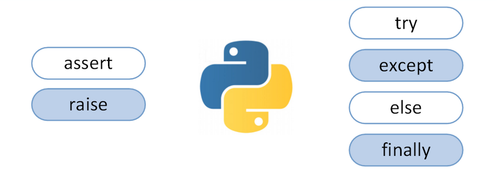
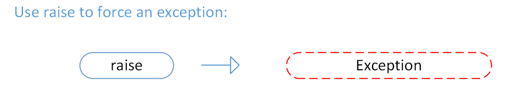
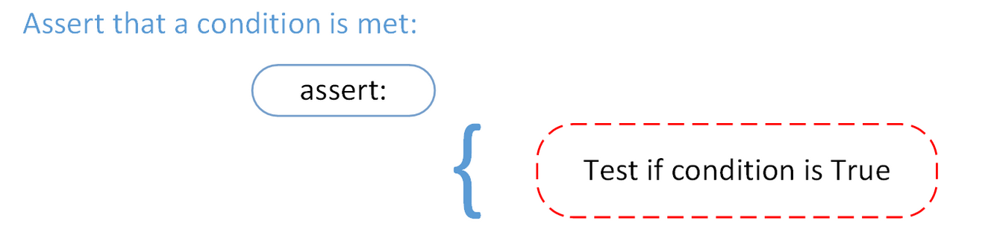
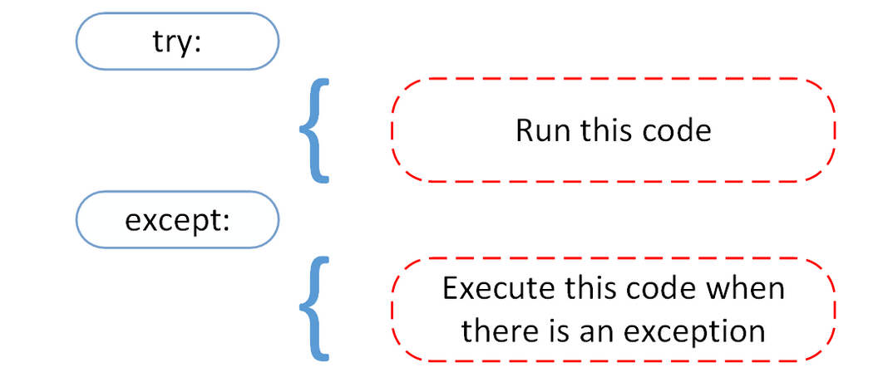
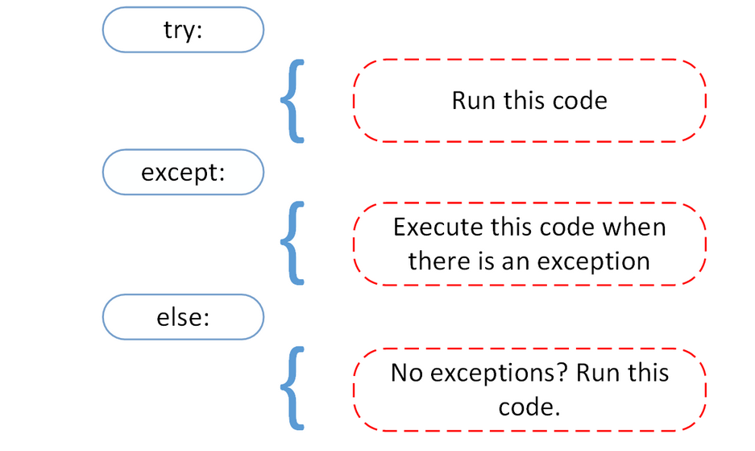
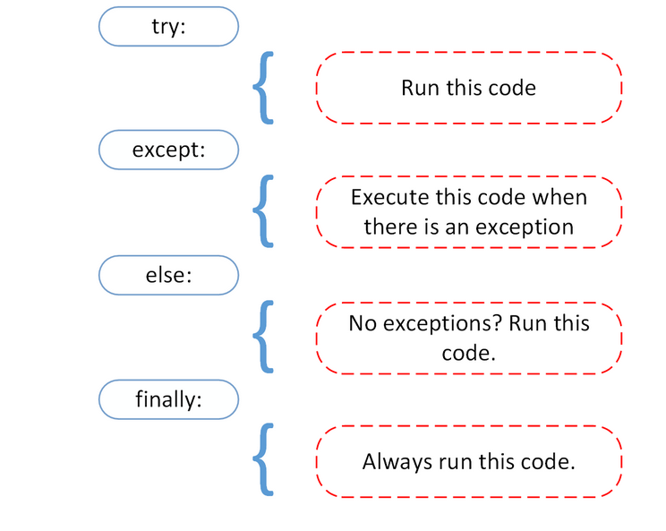

======================================
Python Exceptions: An Introduction
======================================

A Python program terminates as soon as it encounters an error. In Python, an error can be a syntax error or an exception.

An introduction to exceptions in Python
===========================================

Exceptions versus Syntax Errors
-----------------------------------

Syntax errors occur when the parser detects an incorrect statement. Observe the following example:
::

    >>> print( 0 / 0 ))

    File "<stdin>", line 1
        print( 0 / 0 ))
                    ^
    SyntaxError: invalid syntax

**The arrow indicates where the parser ran into the syntax error**. In this example, there was one bracket too many. Remove it and run your code again:
::

    >>> print( 0 / 0)

    Traceback (most recent call last):
    File "<stdin>", line 1, in <module>
    ZeroDivisionError: integer division or modulo by zero

This time, you ran into an exception error. This type of error occurs whenever syntactically correct Python code results in an error. The last line of the message indicated what type of exception error you ran into.

Instead of showing the message exception error, Python details what type of exception error was encountered. In this case, it was a **ZeroDivisionError**. Python comes with various built-in exceptions as well as the possibility to create self-defined exceptions.

Raising an Exception
======================

We can use raise to throw an exception if a condition occurs. The statement can be complemented with a custom exception.

Illustration of raise statement usage
---------------------------------------------

If you want to throw an error when a certain condition occurs using raise, you could go about it like this:
::

    x = 10
    if x > 5:
        raise Exception('x should not exceed 5. The value of x was: {}'.format(x))

When you run this code, the output will be the following:

.. container:: outputs

    | **OUTPUT :**
    | Traceback (most recent call last):
    |  File "<input>", line 4, in <module>
    | Exception: x should not exceed 5. The value of x was: 10

The program comes to a halt and displays our exception to screen, offering clues about what went wrong.

The AssertionError Exception
==============================

Instead of waiting for a program to crash midway, you can also start by making an assertion in Python. We assert that a certain condition is met. If this condition turns out to be True, then that is excellent! The program can continue. If the condition turns out to be False, you can have the program throw an AssertionError exception.

Python assert statement
--------------------------

Have a look at the following example, where it is asserted that the code will be executed on a Linux system:
::

    import sys
    assert ('linux' in sys.platform), "This code runs on Linux only."

If you run this code on a Linux machine, the assertion passes. If you were to run this code on a Windows machine, the outcome of the assertion would be False and the result would be the following:

.. container:: outputs

    | **OUTPUT :**
    | Traceback (most recent call last):
    |   File "<input>", line 2, in <module>
    | AssertionError: This code runs on Linux only.

In this example, throwing an AssertionError exception is the last thing that the program will do. The program will come to halt and will not continue. What if that is not what you want?

The try and except Block: Handling Exceptions
=====================================================

The try and except block in Python is used to catch and handle exceptions. Python executes code following the try statement as a “normal” part of the program. The code that follows the except statement is the program’s response to any exceptions in the preceding try clause.

As you saw earlier, when syntactically correct code runs into an error, Python will throw an exception error. This exception error will crash the program if it is unhandled. The except clause determines how your program responds to exceptions.

The following function can help you understand the try and except block:
::

    def linux_interaction():
        assert ('linux' in sys.platform), "Function can only run on Linux systems."
        print('Doing something.')

The ``linux_interaction()`` can only run on a Linux system. The assert in this function will throw an AssertionError exception if you call it on an operating system other then Linux.

You can give the function a try using the following code:
::

    try:
        linux_interaction()
    except:
        pass

The way you handled the error here is by handing out a pass. If you were to run this code on a Windows machine, you would get the following output:

You got nothing. The good thing here is that the program did not crash. But it would be nice to see if some type of exception occurred whenever you ran your code. To this end, you can change the pass into something that would generate an informative message, like so:
::

    try:
        linux_interaction()
    except:
        print('Linux function was not executed')

Execute this code on a Windows machine:

.. container:: outputs

    | **OUTPUT :**
    | Linux function was not executed

When an exception occurs in a program running this function, the program will continue as well as inform you about the fact that the function call was not successful.

What you did not get to see was the type of error that was thrown as a result of the function call. In order to see exactly what went wrong, you would need to catch the error that the function threw.

The following code is an example where you capture the AssertionError and output that message to screen:
::

    try:
        linux_interaction()
    except AssertionError as error:
        print(error)
        print('The linux_interaction() function was not executed')

Running this function on a Windows machine outputs the following:

.. container:: outputs

    | **OUTPUT :**
    | Function can only run on Linux systems.
    | The linux_interaction() function was not executed

The first message is the AssertionError, informing you that the function can only be executed on a Linux machine. The second message tells you which function was not executed.

In the previous example, you called a function that you wrote yourself. When you executed the function, you caught the AssertionError exception and printed it to screen.

Here’s another example where you open a file and use a built-in exception:
::

    try:
        with open('file.log') as file:
            read_data = file.read()
    except:
        print('Could not open file.log')

If **file.log** does not exist, this block of code will output the following:

.. note::

    This is an informative message, and our program will still continue to run. In the Python docs, you can see that there are a lot of built-in exceptions that you can use here. One exception described on that page is the following:

    Exception FileNotFoundError

    Raised when a file or directory is requested but doesn’t exist. Corresponds to errno ENOENT.

To catch this type of exception and print it to screen, you could use the following code:
::

    try:
        with open('file.log') as file:
            read_data = file.read()
    except FileNotFoundError as fnf_error:
        print(fnf_error)

In this case, if file.log does not exist, the output will be the following:

.. container:: outputs

    | **OUTPUT :**
    | [Errno 2] No such file or directory: 'file.log'

You can have more than one function call in your try clause and anticipate catching various exceptions. A thing to note here is that the code in the try clause will stop as soon as an exception is encountered.

Warning: Catching Exception hides all errors…even those which are completely unexpected. This is why you should avoid bare except clauses in your Python programs. Instead, you’ll want to refer to specific exception classes you want to catch and handle. You can learn more about why this is a good idea in this tutorial.

Look at the following code. Here, you first call the linux_interaction() function and then try to open a file:
::

    try:
        linux_interaction()
        with open('file.log') as file:
            read_data = file.read()
    except FileNotFoundError as fnf_error:
        print(fnf_error)
    except AssertionError as error:
        print(error)
        print('Linux linux_interaction() function was not executed')

If the file does not exist, running this code on a Windows machine will output the following:

.. container:: outputs

    | **OUTPUT :**
    | Function can only run on Linux systems.
    | Linux linux_interaction() function was not executed

Inside the try clause, you ran into an exception immediately and did not get to the part where you attempt to open file.log. Now look at what happens when you run the code on a Linux machine:

.. container:: outputs

    | **OUTPUT :**
    | [Errno 2] No such file or directory: 'file.log'

.. note::

    Here are the key takeaways:

    | A try clause is executed up until the point where the first exception is encountered.

    | Inside the except clause, or the exception handler, you determine how the program responds to the exception.

    | You can anticipate multiple exceptions and differentiate how the program should respond to them. Avoid using bare except clauses.

The else Clause
=======================

In Python, using the else statement, you can instruct a program to execute a certain block of code only in the absence of exceptions.

Look at the following example:
::

    try:
        linux_interaction()
    except AssertionError as error:
        print(error)
    else:
        print('Executing the else clause.')

If you were to run this code on a Linux system, the output would be the following:

.. container:: outputs

    | **OUTPUT :**
    | Doing something.
    | Executing the else clause.

Because the program did not run into any exceptions, the else clause was executed.

You can also try to run code inside the else clause and catch possible exceptions there as well:
::

    try:
        linux_interaction()
    except AssertionError as error:
        print(error)
    else:
        try:
            with open('file.log') as file:
                read_data = file.read()
        except FileNotFoundError as fnf_error:
            print(fnf_error)

If you were to execute this code on a Linux machine, you would get the following result:

.. container:: outputs

    | **OUTPUT :**
    | Doing something.
    | [Errno 2] No such file or directory: 'file.log'

From the output, you can see that the ``linux_interaction()`` function ran. Because no exceptions were encountered, an attempt to open file.log was made. That file did not exist, and instead of opening the file, you caught the FileNotFoundError exception.

Cleaning Up After Using finally
==================================

Imagine that you always had to implement some sort of action to clean up after executing your code. Python enables you to do so using the finally clause.

Have a look at the following example:
::

    try:
        linux_interaction()
    except AssertionError as error:
        print(error)
    else:
        try:
            with open('file.log') as file:
                read_data = file.read()
        except FileNotFoundError as fnf_error:
            print(fnf_error)
    finally:
        print('Cleaning up, irrespective of any exceptions.')

In the previous code, everything in the finally clause will be executed. It does not matter if you encounter an exception somewhere in the try or else clauses. Running the previous code on a Windows machine would output the following:

.. container:: outputs

    | **OUTPUT :**
    | Function can only run on Linux systems.
    | Cleaning up, irrespective of any exceptions.

Summing Up
===================

After seeing the difference between syntax errors and exceptions, you learned about various ways to raise, catch, and handle exceptions in Python. In this article, you saw the following options:

* **raise** allows you to throw an exception at any time.
* **assert** enables you to verify if a certain condition is met and throw an exception if it isn’t.
* In the **try** clause, all statements are executed until an exception is encountered.
* **except** is used to catch and handle the exception(s) that are encountered in the try clause.
* **else** lets you code sections that should run only when no exceptions are encountered in the try clause.
* **finally** enables you to execute sections of code that should always run, with or without any previously encountered exceptions.

