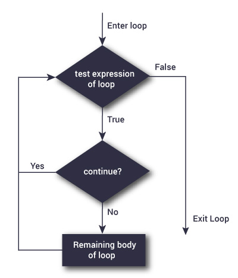

=================
loops in python
=================

Python programming language provides following types of loops to handle looping requirements. Python provides three ways for executing the loops. While all the ways provide similar basic functionality, they differ in their syntax and condition checking time.

.. figure:: img/loop_architecture.jpg
    :width: 40%
    :align: center

    loop architecture

While Loop
============

.. figure:: img/whileLoopFlowchart.jpg
    :width: 35%
    :align: center

In python, while loop is used to execute a block of statements repeatedly until a given a condition is satisfied. And **when the condition becomes false, the line immediately after the loop in program is executed**.

**Syntax :**
::

    while expression:
        statement(s)

All the statements indented by the same number of character spaces after a programming construct are considered to be part of a single block of code. Python uses indentation as its method of grouping statements.

**Example:**
::

    count = 0
    while (count < 3):     
        count = count + 1
        print("Hello Geek") 

.. container:: outputs

    | **OUTPUT :**
    | Hello Geek
    | Hello Geek
    | Hello Geek

Using else statement with while loops
------------------------------------------

As discussed above, while loop executes the block until a condition is satisfied. When the condition becomes false, the statement immediately after the loop is executed.

The **else** clause is only executed when your while condition becomes false. If you break out of the loop, or if an exception is raised, it won’t be executed.

**If else like this:**
::

    if condition: 
        # execute these statements 
    else: 
        # execute these statements 

**and while loop like this are similar**
::

    while condition: 
        # execute these statements 
    else: 
        # execute these statements 

::

    count = 0
    while (count < 3):     
        count = count + 1
        print("Hello Geek") 
    else: 
        print("In Else Block") 

.. container:: outputs

    | **OUTPUT :**
    | Hello Geek
    | Hello Geek
    | Hello Geek
    | In Else Block

Single statement while block
--------------------------------------

Just like the if block, if the while block consists of a single statement the we can declare the entire loop in a single line as shown below:
::

    count = 0
    while (count == 0): print("Hello Geek") 

.. warning::

    It is suggested not to use this type of loops as it is a never ending infinite loop where the condition is always true and you have to forcefully terminate the compiler.

for in Loop
================

.. figure:: img/forLoop.jpg
    :width: 35%
    :align: center

For loops are used for sequential traversal. For example: traversing a list or string or array etc. In Python, there is no C style for loop, i.e., for (i=0; i<n; i++). There is “for in” loop which is similar to for each loop in other languages. Let us learn how to use for in loop for sequential traversals.

**Syntax:**
::

    for iterator_var in sequence:
        statements(s)

The range() function
------------------------

We can generate a sequence of numbers using ``range()`` function. ``range(10)`` will generate numbers from 0 to 9 (10 numbers).

We can also define the start, stop and step size as ``range(start, stop,step_size)``.

``step_size`` defaults to 1 if not provided.

The range object is "lazy" in a sense because it doesn't generate every number that it "contains" when we create it. However, it is not an iterator since it supports ``in``, ``len`` and ``__getitem__`` operations.

This function does not store all the values in memory; it would be inefficient. So it remembers the **start**, **stop**, **step** size and generates the next number on the go.

To force this function to output all the items, we can use the function ``list()``.

The following example will clarify this.
::

    print(range(10))
    print(list(range(10)))
    print(list(range(2, 8)))
    print(list(range(2, 20, 3)))

.. container:: outputs

    | **OUTPUT :**
    | range(0, 10)
    | [0, 1, 2, 3, 4, 5, 6, 7, 8, 9]
    | [2, 3, 4, 5, 6, 7]
    | [2, 5, 8, 11, 14, 17]

**It can be used to iterate over a range and iterators.**

**Example:**
::

    n = 4
    for i in range(0, n): 
        print(i) 

.. container:: outputs

    | **OUTPUT :**
    | 0
    | 1
    | 2
    | 3

**Iterating over a list:**
::

    print("List Iteration") 
    l = ["geeks", "for", "geeks"] 
    for i in l: 
        print(i) 

    print("\nTuple Iteration") 
    t = ("geeks", "for", "geeks") 
    for i in t: 
        print(i) 

    print("\nString Iteration")     
    s = "Geeks"
    for i in s : 
        print(i) 

    print("\nDictionary Iteration")    
    d = dict()  
    d['xyz'] = 123
    d['abc'] = 345
    for i in d : 
        print("%s  %d" %(i, d[i])) 

.. container:: outputs

    | **OUTPUT :**
    | List Iteration
    | geeks
    | for
    | geeks

    | Tuple Iteration
    | geeks
    | for
    | geeks

    | String Iteration
    | G
    | e
    | e
    | k
    | s

    | Dictionary Iteration
    | xyz  123
    | abc  345

Iterating by index of sequences
===================================

We can also use the index of elements in the sequence to iterate. The key idea is to first calculate the length of the list and in iterate over the sequence within the range of this length.

**See the below example:**
::

    list = ["geeks", "for", "geeks"] 
    for index in range(len(list)): 
        print list[index] 

.. container:: outputs

    | **OUTPUT :**
    | geeks
    | for
    | geeks

Using else statement with for loops
========================================

We can also combine else statement with for loop like in while loop. But as there is no condition in for loop based on which the execution will terminate so the else block will be executed immediately after for block finishes execution.

**Below example explains how to do this:**
::

    list = ["geeks", "for", "geeks"] 
    for index in range(len(list)): 
        print list[index] 
    else: 
        print "Inside Else Block"

.. container:: outputs

    | **OUTPUT :**
    | geeks
    | for
    | geeks
    | Inside Else Block

Nested Loops
===================

Python programming language allows to use one loop inside another loop. Following section shows few examples to illustrate the concept.

**Syntax:**
::

    for iterator_var in sequence: 
        for iterator_var in sequence: 
            statements(s) 
            statements(s) 

The syntax for a nested while loop statement in Python programming language is as follows:
::

    while expression: 
        while expression:  
            statement(s) 
            statement(s) 

A final note on loop nesting is that we can put any type of loop inside of any other type of loop. For example a for loop can be inside a while loop or vice versa.

::

    from __future__ import print_function 

    for i in range(1, 5): 
        for j in range(i): 
            print(i, end=' ') 
        print() 

.. container:: outputs

    | **OUTPUT :**
    | 1
    | 2 2
    | 3 3 3
    | 4 4 4 4

Loop Control Statements
===========================

Loop control statements change execution from its normal sequence. When execution leaves a scope, all automatic objects that were created in that scope are destroyed. Python supports the following control statements.

Continue Statement
------------------------

    Flowchart of continue statement in Python

It returns the control to the beginning of the loop.
::

    for letter in 'geeksforgeeks':  
        if letter == 'e' or letter == 's': 
            continue
        print 'Current Letter :', letter 
        var = 10

.. container:: outputs

    | **OUTPUT :**
    | Current Letter : g
    | Current Letter : k
    | Current Letter : f
    | Current Letter : o
    | Current Letter : r
    | Current Letter : g
    | Current Letter : k

Break Statement
--------------------

.. figure:: img/flowchart-break-statement.jpg
    :width: 40%
    :align: center

    Flowchart of break statement in Python

It brings control out of the loop
::

    for letter in 'geeksforgeeks':  
        if letter == 'e' or letter == 's': 
            break
    print 'Current Letter :', letter 

.. container:: outputs

    | **OUTPUT :**
    | Current Letter : e

Pass Statement
----------------

We use pass statement to write empty loops. Pass is also used for empty control statement, function and classes.
::

    for letter in 'geeksforgeeks': 
        pass
    print 'Last Letter :', letter 

.. container:: outputs

    | **OUTPUT :**
    | Last Letter : s

