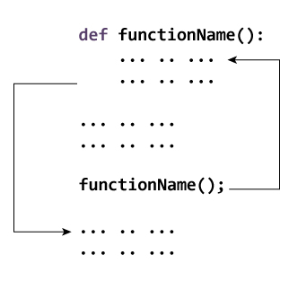

========================
Python - Functions 
========================

**A function is a block of organized, reusable code that is used to perform a single, related action. Functions provide better modularity for your application and a high degree of code reusing.**

As you already know, Python gives you many **built-in functions** like ``print()``, etc. but you can also create your own functions. These functions are called **user-defined functions**.

Types of Functions
======================

Basically, we can divide functions into the following two types:

* :ref:`Built-in functions<built-in-function>` - Functions that are built into Python.
* User-defined functions - Functions defined by the users themselves.

Defining a Function
=====================

You can define functions to provide the required functionality. Here are simple rules to define a function in Python.

* Function blocks begin with the keyword **def** followed by the function name and ``parentheses ( )``.

* Any input parameters or arguments should be placed within these parentheses. You can also define parameters inside these parentheses.

* The first statement of a function can be an optional statement - the documentation string of the function or docstring.

* The code block within every function starts with a **colon (:)** and is indented.

* The statement ``return [expression]`` exits a function, optionally passing back an expression to the caller. A return statement with no arguments is the same as return None.

    Working of functions in Python

Syntax
---------
::

    def functionname( parameters ):
    "function_docstring"
    function_suite
    return [expression]

**By default, parameters have a positional behavior and you need to inform them in the same order that they were defined.**

Example
--------------

The following function takes a string as input parameter and prints it on standard screen.
::

    def printme( str ):
    "This prints a passed string into this function"
    print str
    return

.. note::

    In the above example, we have a docstring immediately below the function header. We generally use triple quotes so that docstring can extend up to multiple lines. This string is available to us as the ``__doc__`` attribute of the function.
    ::

        print(functionName.__doc__)

The pass Statement
=====================

function definitions cannot be empty, but if you for some reason have a function definition with no content, put in the pass statement to avoid getting an error.
::

    def myfunction():
    pass

Calling a Function
======================

Defining a function only gives it a name, specifies the parameters that are to be included in the function and structures the blocks of code.

Once the basic structure of a function is finalized, you can execute it by calling it from another function or directly from the Python prompt. Following is the example to call ``printme()`` function :
::

    # Function definition is here
    def printme( str ):
    "This prints a passed string into this function"
    print str
    return;

    # Now you can call printme function
    printme("I'm first call to user defined function!")
    printme("Again second call to the same function")

When the above code is executed, it produces the following result:

.. container:: outputs

    | **OUTPUT :**
    | I'm first call to user defined function!
    | Again second call to the same function

Pass by reference vs value
=============================

**All parameters (arguments) in the Python language are passed by reference.** It means if you change what a parameter refers to within a function, the change also reflects back in the calling function. For example :

::

    # Function definition is here
    def changeme( mylist ):
    "This changes a passed list into this function"
    mylist = [1,2,3,4]; # This would assig new reference in mylist
    print "Values inside the function: ", mylist
    return

    # Now you can call changeme function
    mylist = [10,20,30];
    changeme( mylist );
    print "Values outside the function: ", mylist

The parameter mylist is local to the function changeme. Changing mylist within the function does not affect mylist. The function accomplishes nothing and finally this would produce the following result :

.. container:: outputs

    | **OUTPUT :**
    | Values inside the function:  [1, 2, 3, 4]
    | Values outside the function:  [10, 20, 30]

Function Arguments
====================

You can call a function by using the following types of formal arguments :

* Required arguments
* Keyword arguments
* Default arguments
* Variable-length arguments

Required arguments
-------------------------

Required arguments are the arguments passed to a function in correct positional order. Here, the number of arguments in the function call should match exactly with the function definition.

To call the function printme(), you definitely need to pass one argument, otherwise it gives a syntax error as follows :
::

    # Function definition is here
    def printme( str ):
    "This prints a passed string into this function"
    print str
    return;

    # Now you can call printme function
    printme()

When the above code is executed, it produces the following result :

.. container:: outputs

    | **OUTPUT :**
    | Traceback (most recent call last):
    |   File "test.py", line 11, in <module>
    |      printme();
    | TypeError: printme() takes exactly 1 argument (0 given)

Keyword arguments
-------------------

Keyword arguments are related to the function calls. When you use keyword arguments in a function call, the caller identifies the arguments by the parameter name.

This allows you to skip arguments or place them out of order because the Python interpreter is able to use the keywords provided to match the values with parameters. You can also make keyword calls to the printme() function in the following ways:
::

    # Function definition is here
    def printinfo( name, age ):
    "This prints a passed info into this function"
    print "Name: ", name
    print "Age ", age
    return;

    # Now you can call printinfo function
    printinfo( age=50, name="miki" )

When the above code is executed, it produces the following result :

.. container:: outputs

    | **OUTPUT :**
    | Name:  miki
    | Age  50

.. seealso:: To learn more about Keyword arguments visit :doc:`variableArguments`

Default arguments
----------------------

A default argument is an argument that assumes a default value if a value is not provided in the function call for that argument. The following example gives an idea on default arguments, it prints default age if it is not passed −
::

    # Function definition is here
    def printinfo( name, age = 35 ):
    "This prints a passed info into this function"
    print "Name: ", name
    print "Age ", age
    return;

    # Now you can call printinfo function
    printinfo( age=50, name="miki" )
    printinfo( name="miki" )

When the above code is executed, it produces the following result :

.. container:: outputs

    | **OUTPUT :**
    | Name:  miki
    | Age  50
    | Name:  miki
    | Age  35

Variable-length arguments
-----------------------------

You may need to process a function for more arguments than you specified while defining the function. These arguments are called variable-length arguments and are not named in the function definition, unlike required and default arguments.

An **asterisk (\*)** is placed before the variable name that holds the values of all nonkeyword variable arguments. This tuple remains empty if no additional arguments are specified during the function call. Following is a simple example:
::

    # Function definition is here
    def printinfo( arg1, *vartuple ):
    "This prints a variable passed arguments"
    print "Output is: "
    print arg1
    for var in vartuple:
        print var
    return;

    # Now you can call printinfo function
    printinfo( 10 )
    printinfo( 70, 60, 50 )

When the above code is executed, it produces the following result :

.. container:: outputs

    | **OUTPUT :**
    | Output is:
    | 10
    | Output is:
    | 70
    | 60
    | 50

The Anonymous Functions
===========================

These functions are called anonymous because they are not declared in the standard manner by using the def keyword. You can use the lambda keyword to create small anonymous functions.

* Lambda forms can take any number of arguments but return just one value in the form of an expression. They cannot contain commands or multiple expressions.

* An anonymous function cannot be a direct call to print because lambda requires an expression

* Lambda functions have their own local namespace and cannot access variables other than those in their parameter list and those in the global namespace.

* Although it appears that lambda's are a one-line version of a function, they are not equivalent to inline statements in C or C++, whose purpose is by passing function stack allocation during invocation for performance reasons.

Syntax
----------

The syntax of lambda functions contains only a single statement, which is as follows :
::

    lambda [arg1 [,arg2,.....argn]]:expression

Following is the example to show how lambda form of function works :
::

    # Function definition is here
    sum = lambda arg1, arg2: arg1 + arg2;

    # Now you can call sum as a function
    print "Value of total : ", sum( 10, 20 )
    print "Value of total : ", sum( 20, 20 )

When the above code is executed, it produces the following result :

.. container:: outputs

    | **OUTPUT :**
    | Value of total :  30
    | Value of total :  40

The return Statement
=======================

The statement return [expression] exits a function, optionally passing back an expression to the caller. A return statement with no arguments is the same as return None.

All the above examples are not returning any value. You can return a value from a function as follows :
::

    # Function definition is here
    def sum( arg1, arg2 ):
    # Add both the parameters and return them."
    total = arg1 + arg2
    print "Inside the function : ", total
    return total;

    # Now you can call sum function
    total = sum( 10, 20 );
    print "Outside the function : ", total 

When the above code is executed, it produces the following result :

.. container:: outputs

    | **OUTPUT :**
    | Inside the function :  30
    | Outside the function :  30

Scope of Variables
=======================

All variables in a program may not be accessible at all locations in that program. This depends on where you have declared a variable.

The scope of a variable determines the portion of the program where you can access a particular identifier. There are two basic scopes of variables in Python :

* **Global variables**
* **Local variables**

Global vs. Local variables
-------------------------------

Variables that are defined inside a function body have a local scope, and those defined outside have a global scope.

**This means that local variables can be accessed only inside the function** in which they are declared, whereas global variables can be accessed throughout the program body by all functions. 

When you call a function, the variables declared inside it are brought into scope. Following is a simple example :
::

    total = 0; # This is global variable.
    # Function definition is here
    def sum( arg1, arg2 ):
    # Add both the parameters and return them."
    total = arg1 + arg2; # Here total is local variable.
    print "Inside the function local total : ", total
    return total;

    # Now you can call sum function
    sum( 10, 20 );
    print "Outside the function global total : ", total 

When the above code is executed, it produces the following result :

.. container:: outputs

    | **OUTPUT :**
    | Inside the function local total :  30
    | Outside the function global total :  0

