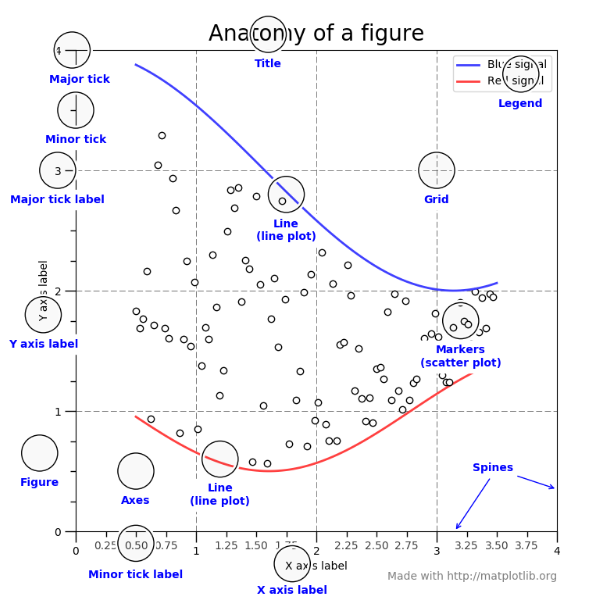
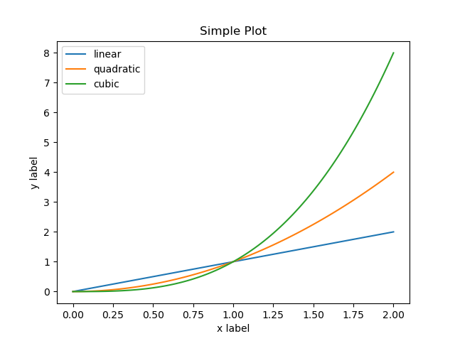

======================================
Python Introduction to Matplotlib
======================================

Installation Guide
====================
::

    python -m pip install -U pip
    python -m pip install -U matplotlib

Parts of a Figure
====================

Now, let's have a deeper look at the components of a Matplotlib figure.

Figure
----------

The whole figure. The figure keeps track of all the child ``Axes``, a smattering of 'special' artists (**titles, figure legends, etc**), and the canvas. A figure can contain any number of Axes, but will typically have at least one.

The easiest way to create a new figure is with pyplot:
::

    fig = plt.figure()  # an empty figure with no Axes
    fig, ax = plt.subplots()  # a figure with a single Axes
    fig, axs = plt.subplots(2, 2)  # a figure with a 2x2 grid of Axes

It's convenient to create the axes together with the figure, but you can also add axes later on, allowing for more complex axes layouts.

Axes
-------

This is what you think of as 'a plot', it is the region of the image with the data space.** A given figure can contain many Axes, but a given Axes object can only be in one Figure**. The Axes contains two (or three in the case of 3D).

Axis objects (be aware of the difference between Axes and Axis) which take care of the data limits (the data limits can also be controlled via the ``axes.Axes.set_xlim()`` and ``axes.Axes.set_ylim()`` methods.

Each Axes has a **title** ``set via set_title()``, an **x-label** set via ``set_xlabel()``, and a **y-label** set via ``set_ylabel())``.

The Axes class and its member functions are the primary entry point to working with the OO interface.

Axis
-------

These are the number-line-like objects. They take care of setting the graph limits and generating the ticks (the marks on the axis) and ticklabels (strings labeling the ticks).

The location of the ticks is determined by a Locator object and the ticklabel strings are formatted by a Formatter. The combination of the correct Locator and Formatter gives very fine control over the tick locations and labels.

Artist
---------

Basically everything you can see on the figure is an artist (even the **Figure, Axes, and Axis objects**). This includes Text objects, Line2D objects, collections objects, Patch objects ... (you get the idea).

When the figure is rendered, all of the artists are drawn to the canvas. Most Artists are tied to an Axes; such an Artist cannot be shared by multiple Axes, or moved from one to another.

The object-oriented interface and the pyplot interface
=============================================================

As noted above, there are essentially two ways to use Matplotlib:

* Explicitly create figures and axes, and call methods on them (the "object-oriented (OO) style").
* Rely on pyplot to automatically create and manage the figures and axes, and use pyplot functions for plotting.

OO-style
-----------
::

    import numpy as np
    import matplotlib.pyplot as plt

    x = np.linspace(0, 2, 100)
    # Note that even in the OO-style, we use `.pyplot.figure` to create the figure.
    fig, ax = plt.subplots()  # Create a figure and an axes.
    ax.plot(x, x, label='linear')  # Plot some data on the axes.
    ax.plot(x, x**2, label='quadratic')  # Plot more data on the axes...
    ax.plot(x, x**3, label='cubic')  # ... and some more.
    ax.set_xlabel('x label')  # Add an x-label to the axes.
    ax.set_ylabel('y label')  # Add a y-label to the axes.
    ax.set_title("Simple Plot")  # Add a title to the axes.
    ax.legend()  # Add a legend.
    plt.show()

    
pyplot-style
---------------
::

    import numpy as np
    import matplotlib.pyplot as plt

    x = np.linspace(0, 2, 100)
    plt.plot(x, x, label='linear')  # Plot some data on the (implicit) axes.
    plt.plot(x, x**2, label='quadratic')  # etc.
    plt.plot(x, x**3, label='cubic')
    plt.xlabel('x label')
    plt.ylabel('y label')
    plt.title("Simple Plot")
    plt.legend()
    plot.show()

.. note::

    the **pyplot** API is generally less-flexible than the **object-oriented** API. Most of the function calls you see here can also be called as methods from an ``Axes`` object.