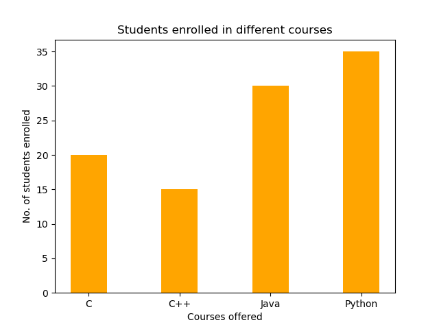
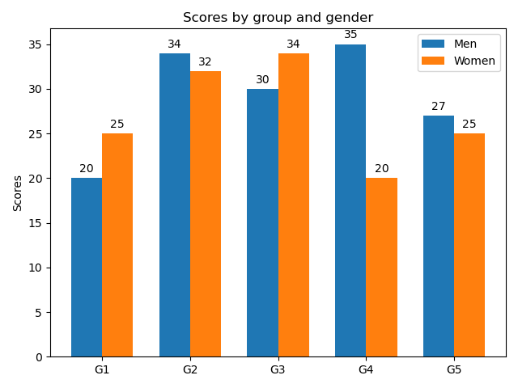
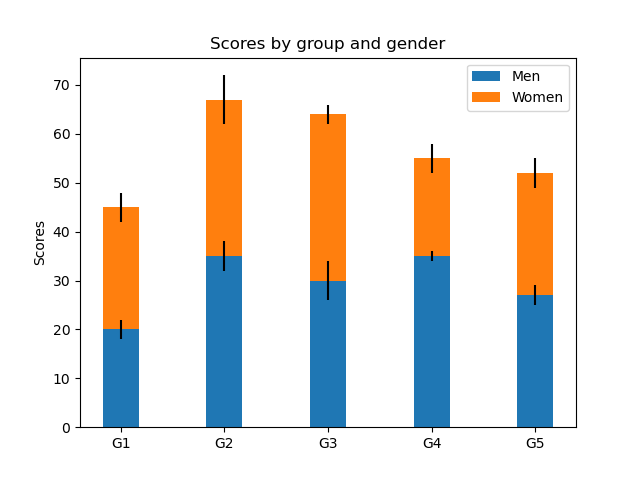
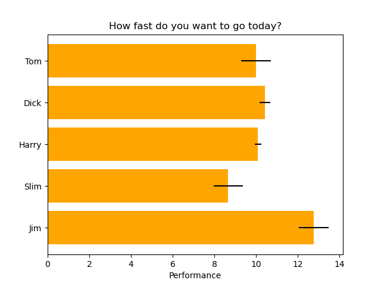

=========================
Matplotlib - Bar Plot
=========================

Bar Plot
=========
::

    ax.bar(x, height, width, bottom, align)

.. csv-table::
   :header: property,Description
   :widths: 20, 80
   :file: csv/bar_property.csv
   :align: center 

Example
-----------

::

    import numpy as np
    import matplotlib.pyplot as plt

    # creating the dataset
    data = {'C': 20, 'C++': 15, 'Java': 30,
            'Python': 35}
    courses = list(data.keys())
    values = list(data.values())

    # creating the bar plot
    plt.bar(courses, values, color='maroon',
            width=0.4)

    plt.xlabel("Courses offered")
    plt.ylabel("No. of students enrolled")
    plt.title("Students enrolled in different courses")
    plt.show()

Grouped bar chart with labels
================================

::

    import matplotlib
    import matplotlib.pyplot as plt
    import numpy as np

    labels = ['G1', 'G2', 'G3', 'G4', 'G5']
    men_means = [20, 34, 30, 35, 27]
    women_means = [25, 32, 34, 20, 25]

    x = np.arange(len(labels))  # the label locations
    width = 0.35  # the width of the bars

    fig, ax = plt.subplots()
    rects1 = ax.bar(x - width/2, men_means, width, label='Men')
    rects2 = ax.bar(x + width/2, women_means, width, label='Women')

    # Add some text for labels, title and custom x-axis tick labels, etc.
    ax.set_ylabel('Scores')
    ax.set_title('Scores by group and gender')
    ax.set_xticks(x)
    ax.set_xticklabels(labels)
    ax.legend()

    def autolabel(rects):
        """Attach a text label above each bar in *rects*, displaying its height."""
        for rect in rects:
            height = rect.get_height()
            ax.annotate('{}'.format(height),
                        xy=(rect.get_x() + rect.get_width() / 2, height),
                        xytext=(0, 3),  # 3 points vertical offset
                        textcoords="offset points",
                        ha='center', va='bottom')

    autolabel(rects1)
    autolabel(rects2)

    fig.tight_layout()

    plt.show()

Stacked bar chart
======================

::

    import matplotlib.pyplot as plt

    labels = ['G1', 'G2', 'G3', 'G4', 'G5']
    men_means = [20, 35, 30, 35, 27]
    women_means = [25, 32, 34, 20, 25]
    men_std = [2, 3, 4, 1, 2]
    women_std = [3, 5, 2, 3, 3]
    width = 0.35       # the width of the bars: can also be len(x) sequence

    fig, ax = plt.subplots()

    ax.bar(labels, men_means, width, yerr=men_std, label='Men')
    ax.bar(labels, women_means, width, yerr=women_std, bottom=men_means,
        label='Women')

    ax.set_ylabel('Scores')
    ax.set_title('Scores by group and gender')
    ax.legend()

    plt.show()

Horizontal bar chart
=======================

::

    import matplotlib.pyplot as plt
    import numpy as np

    # Fixing random state for reproducibility
    np.random.seed(19680801)

    plt.rcdefaults()
    fig, ax = plt.subplots()

    # Example data
    people = ('Tom', 'Dick', 'Harry', 'Slim', 'Jim')
    y_pos = np.arange(len(people))
    performance = 3 + 10 * np.random.rand(len(people))
    error = np.random.rand(len(people))

    ax.barh(y_pos, performance, xerr=error, align='center')
    ax.set_yticks(y_pos)
    ax.set_yticklabels(people)
    ax.invert_yaxis()  # labels read top-to-bottom
    ax.set_xlabel('Performance')
    ax.set_title('How fast do you want to go today?')

    plt.show()
