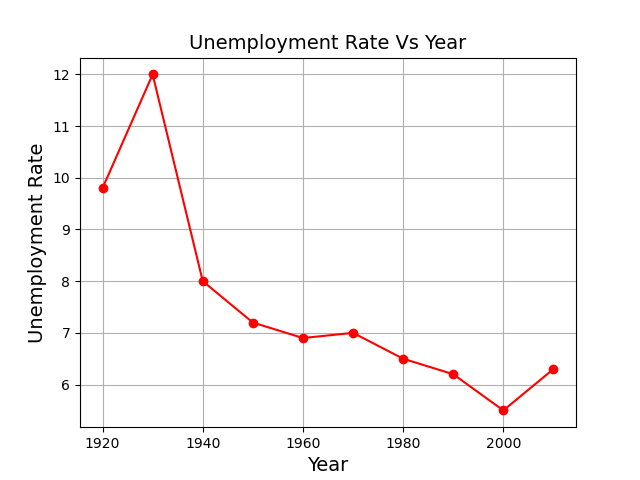
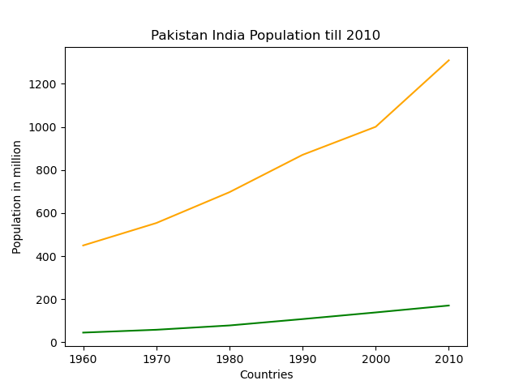

========================
Matplotlib - line chart
========================

Basic line chart
===================

Example 1
------------

::

    import matplotlib.pyplot as plt
    
    Year = [1920,1930,1940,1950,1960,1970,1980,1990,2000,2010]
    Unemployment_Rate = [9.8,12,8,7.2,6.9,7,6.5,6.2,5.5,6.3]
    
    plt.plot(Year, Unemployment_Rate, color='red', marker='o')
    plt.title('Unemployment Rate Vs Year', fontsize=14)
    plt.xlabel('Year', fontsize=14)
    plt.ylabel('Unemployment Rate', fontsize=14)
    plt.grid(True)
    plt.show()

Example 2
-------------

::

    import matplotlib.pyplot as plt

    year = [1960, 1970, 1980, 1990, 2000, 2010]
    pop_pakistan = [44.91, 58.09, 78.07, 107.7, 138.5, 170.6]
    pop_india = [449.48, 553.57, 696.783, 870.133, 1000.4, 1309.1]
    plt.plot(year, pop_pakistan, color='g')
    plt.plot(year, pop_india, color='orange')
    plt.xlabel('Countries')
    plt.ylabel('Population in million')
    plt.title('Pakistan India Population till 2010')
    plt.show()
