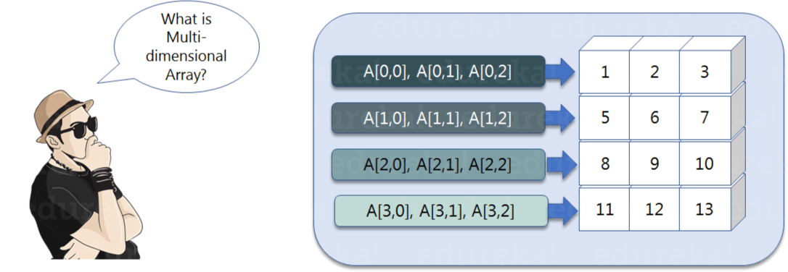
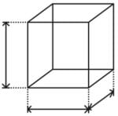
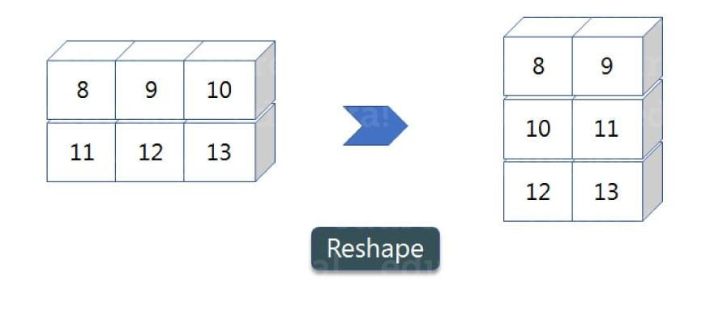
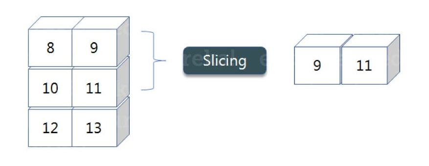
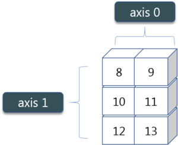
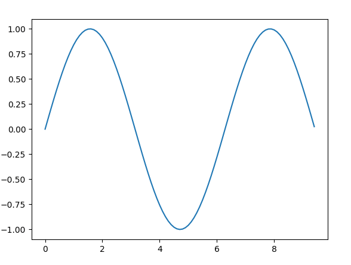
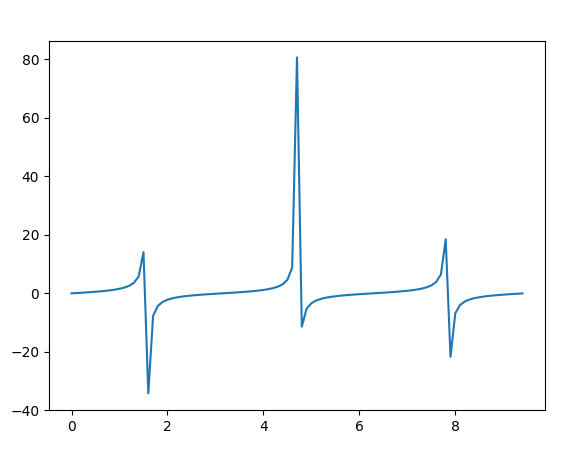

===============================
Python NumPy Tutorial
===============================

Introduction
=================

**What are NumPy Arrays?**

NumPy is a Python package that stands for ``Numerical Python``. It is the core library for scientific computing, which contains a powerful n-dimensional array object.

**Where is NumPy used?**

Python NumPy arrays provide tools for integrating C, C++, etc. It is also useful in linear algebra, random number capability etc. NumPy array can also be used as an efficient multi-dimensional container for generic data. Now, let me tell you what exactly is a Python NumPy array.

**Python NumPy Array**

Numpy array is a powerful N-dimensional array object which is in the form of rows and columns. We can initialize NumPy arrays from nested Python lists and access it elements. In order to perform these NumPy operations, the next question which will come in your mind is:

**How do I install NumPy?**

To install Python NumPy, go to your command prompt and type ``pip install numpy``. Once the installation is completed, go to your IDE (For example: PyCharm) and simply import it by typing: ``import numpy as np``
::

    pip install numpy

Array
=======

I have different elements that are stored in their respective memory locations. It is said to be two dimensional because it has rows as well as columns. In the above image, we have 3 columns and 4 rows available.

Single-dimensional Numpy Array
--------------------------------
::

    import numpy as np
    a=np.array([1,2,3])
    print(a)

.. container:: outputs

    | **OUTPUT :**
    | [1 2 3]

Multi-dimensional Array
----------------------------

::

    a=np.array([(1,2,3),(4,5,6)])
    print(a)

.. container:: outputs

    | **OUTPUT :**
    | [[ 1 2 3] [4 5 6]]

Python NumPy Array v/s List
===============================

**Why NumPy is used in Python?**

We use python NumPy array instead of a list because of the below three reasons:

* Less Memory
* Fast
* Convenient

The very first reason to choose python NumPy array is that it occupies less memory as compared to list. Then, it is pretty fast in terms of execution and at the same time, it is very convenient to work with NumPy. So these are the major advantages that Python NumPy array has over list.

**memory comparison**

::

    import numpy as np
    
    import time
    import sys
    S= range(1000)
    print(sys.getsizeof(5)*len(S))
    
    D= np.arange(1000)
    print(D.size*D.itemsize)

.. container:: outputs

    | **OUTPUT :**
    | 14000
    | 4000

The above output shows that the memory allocated by list (denoted by S) is **14000** whereas the memory allocated by the NumPy array is just **4000**. From this, you can conclude that there is a major difference between the two and this makes Python NumPy array as the preferred choice over list.

**speed comparison**
::

    import time
    import sys
    
    SIZE = 1000000
    
    L1= range(SIZE)
    L2= range(SIZE)
    A1= np.arange(SIZE)
    A2=np.arange(SIZE)
    
    start= time.time()
    result=[(x,y) for x,y in zip(L1,L2)]
    print((time.time()-start)*1000)
    
    start=time.time()
    result= A1+A2
    print((time.time()-start)*1000)

.. container:: outputs

    | **OUTPUT :**
    | 380.9998035430908
    | 49.99995231628418

In the above code, we have defined two lists and two numpy arrays. Then, we have compared the time taken in order to find the sum of lists and sum of numpy arrays both. If you see the output of the above program, there is a significant change in the two values. **List took 380ms whereas the numpy array took almost 49ms**.

Hence, numpy array is faster than list. Now, if you noticed we had run a ‘for’ loop for a list which returns the concatenation of both the lists whereas for numpy arrays, we have just added the two array by simply printing A1+A2. **That’s why working with numpy is much easier and convenient when compared to the lists.**

Python NumPy Operations
============================

ndim
------

You can find the dimension of the array, whether it is a two-dimensional array or a single dimensional array. So, let us see this practically how we can find the dimensions. In the below code, with the help of ``ndim`` function, I can find whether the array is of single dimension or multi dimension.

    three dimensional array cube

::

    import numpy as np
    a = np.array([(1,2,3),(4,5,6)])
    print(a.ndim)

.. container:: outputs

    | **OUTPUT :**
    | 2

Since the output is 2, it is a two-dimensional array (multi dimension).

itemsize
------------

You can calculate the byte size of each element. In the below code, I have defined a single dimensional array and with the help of ``itemsize`` function, we can find the size of each element.
::

    import numpy as np
    a = np.array([(1,2,3)])
    print(a.itemsize)

.. container:: outputs

    | **OUTPUT :**
    | 4

So every element occupies 4 byte in the above numpy array.

dtype
-------

You can find the data type of the elements that are stored in an array. So, if you want to know the data type of a particular element, you can use ``dtype`` function which will print the datatype along with the size. In the below code, I have defined an array where I have used the same function.
::

    import numpy as np
    a = np.array([(1,2,3)])
    print(a.dtype)

.. container:: outputs

    | **OUTPUT :**
    | int32

As you can see, the data type of the array is integer 32 bits. Similarly, you can find the size and shape of the array using ``size`` and ``shape`` function respectively.
::

    import numpy as np
    a = np.array([(1,2,3,4,5,6)])
    print(a.size)
    print(a.shape)

.. container:: outputs

    | **OUTPUT :**
    | 6
    | (1,6)

reshape
-----------

Reshape is when you change the number of rows and columns which gives a new view to an object. Now, let us take an example to reshape the below array:

As you can see in the above image, we have **3 columns and 2 rows** which has converted into **2 columns and 3 rows.** Let me show you practically how it’s done.
::

    import numpy as np
    a = np.array([(8,9,10),(11,12,13)])
    print(a)
    a=a.reshape(3,2)
    print(a)

.. container:: outputs

    | **OUTPUT :**
    | [[ 8 9 10] [11 12 13]] [[ 8 9] [10 11] [12 13]]

slicing
-----------

Slicing is basically extracting particular set of elements from an array. This slicing operation is pretty much similar to the one which is there in the list as well. Consider the following example:

Before getting into the above example, let’s see a simple one. We have an array and we need a particular element (say 3) out of a given array. Let’s consider the below example:

::

    import numpy as np
    a=np.array([(1,2,3,4),(3,4,5,6)])
    print(a[0,2])

.. container:: outputs

    | **OUTPUT :**
    | 3

Here, the array(1,2,3,4) is your index 0 and (3,4,5,6) is index 1 of the python numpy array. Therefore, we have printed the second element from the zeroth index.

Taking one step forward, let’s say we need the 2nd element from the zeroth and first index of the array. Let’s see how you can perform this operation:
::

    import numpy as np
    a=np.array([(1,2,3,4),(3,4,5,6)])
    print(a[0:,2])

.. container:: outputs

    | **OUTPUT :**
    | [3 5]

Here colon represents all the rows, including zero. Now to get the 2nd element, we’ll call index 2 from both of the rows which gives us the value 3 and 5 respectively.

Next, just to remove the confusion, let’s say we have one more row and we don’t want to get its 2nd element printed just as the image above. What we can do in such case?
Consider the below code:
::

    import numpy as np
    a=np.array([(8,9),(10,11),(12,13)])
    print(a[0:2,1])

.. container:: outputs

    | **OUTPUT :**
    | [9 11]

As you can see in the above code, only 9 and 11 gets printed. Now when I have written 0:2, this does not include the second index of the third row of an array. Therefore, only 9 and 11 gets printed else you will get all the elements i.e [9 11 13].

linspace
----------

This is another operation in python numpy which returns evenly spaced numbers over a specified interval. Consider the below example:
::

    import numpy as np
    a=np.linspace(1,3,10)
    print(a)

.. container:: outputs

    | **OUTPUT :**
    | [ 1. 1.22222222 1.44444444 1.66666667 1.88888889 2.11111111 2.33333333 2.55555556 2.77777778 3. ]

As you can see in the result, it has printed 10 values between 1 to 3.

max/ min
-----------

Next, we have some more operations in numpy such as to find the minimum, maximum as well the sum of the numpy array. Let’s go ahead in python numpy tutorial and execute it practically.
::

    import numpy as np
    
    a= np.array([1,2,3])
    print(a.min())
    print(a.max())
    print(a.sum())

.. container:: outputs

    | **OUTPUT :**
    | 1 3 6

Axis
=======

As you can see in the figure, we have a numpy array 2*3. Here the rows are called as axis 1 and the columns are called as axis 0. Now you must be wondering what is the use of these axis?

Suppose you want to calculate the sum of all the columns, then you can make use of axis. Let me show you practically, how you can implement axis in your PyCharm:
::

    a= np.array([(1,2,3),(3,4,5)])
    print(a.sum(axis=0))

.. container:: outputs

    | **OUTPUT :**
    | [4 6 8]

Therefore, the sum of all the columns are added where 1+3=4, 2+4=6 and 3+5=8. Similarly, if you replace the axis by 1, then it will print [6 12] where all the rows get added.

Square Root & Standard Deviation
====================================

There are various mathematical functions that can be performed using python numpy. You can find the square root, standard deviation of the array. So, let’s implement these operations: 
::

    import numpy as np
    a=np.array([(1,2,3),(3,4,5,)])
    print(np.sqrt(a))
    print(np.std(a))

.. container:: outputs

    | **OUTPUT :**
    | [[ 1. 1.41421356 1.73205081] [ 1.73205081 2. 2.23606798]]
    | 1.29099444874

As you can see the output above, the square root of all the elements are printed. Also, the standard deviation is printed for the above array i.e how much each element varies from the mean value of the python numpy array.

Addition Operation
========================

You can perform more operations on numpy array i.e addition, subtraction,multiplication and division of the two matrices. Let me go ahead in python numpy tutorial, and show it to you practically: 
::

    import numpy as np
    x= np.array([(1,2,3),(3,4,5)])
    y= np.array([(1,2,3),(3,4,5)])
    print(x+y)

.. container:: outputs

    | **OUTPUT :**
    | [[ 2 4 6] [ 6 8 10]]

This is extremely simple! Right? Similarly, we can perform other operations such as subtraction, multiplication and division. Consider the below example:
::

    import numpy as np
    x= np.array([(1,2,3),(3,4,5)])
    y= np.array([(1,2,3),(3,4,5)])
    print(x-y)
    print(x*y)
    print(x/y)

.. container:: outputs

    | **OUTPUT :**
    | [[0 0 0] [0 0 0]]
    | [[ 1 4 9] [ 9 16 25]]
    | [[ 1. 1. 1.] [ 1. 1. 1.]]

Vertical & Horizontal Stacking
======================================

Next, if you want to concatenate two arrays and not just add them, you can perform it using two ways – vertical stacking and horizontal stacking. Let me show it one by one in this python numpy tutorial.
::

    import numpy as np
    x= np.array([(1,2,3),(3,4,5)])
    y= np.array([(1,2,3),(3,4,5)])
    print(np.vstack((x,y)))
    print(np.hstack((x,y)))

.. container:: outputs

    | **OUTPUT :**
    | [[1 2 3] [3 4 5] [1 2 3] [3 4 5]]
    | [[1 2 3 1 2 3] [3 4 5 3 4 5]]

ravel
===========

There is one more operation where you can convert one numpy array into a single column i.e ravel. Let me show how it is implemented practically:
::

    import numpy as np
    x= np.array([(1,2,3),(3,4,5)])
    print(x.ravel())

.. container:: outputs

    | **OUTPUT :**
    | [ 1 2 3 3 4 5]

Python Numpy Special Functions
==================================

There are various special functions available in numpy such as sine, cosine, tan, log etc. First, let’s begin with sine function where we will learn to plot its graph. For that, we need to import a module called **matplotlib**. To understand the basics and practical implementations of this module, you can refer :ref:`Matplotlib Tutorial <MatplotlibTutorial>`. Moving ahead with python numpy tutorial, let’s see how these graphs are plotted.

::

    import numpy as np
    import matplotlib.pyplot as plt
    x= np.arange(0,3*np.pi,0.1)
    y=np.sin(x)
    plt.plot(x,y)
    plt.show()

**Output:**

    sin function graph

Similarly, you can plot a graph for any trigonometric function such as cos, tan etc. Let me show you one more example where you can plot a graph of another function, let’s say tan.
::

    import numpy as np
    import matplotlib.pyplot as plt
    x= np.arange(0,3*np.pi,0.1)
    y=np.tan(x)
    plt.plot(x,y)
    plt.show()

**OUTPUT:**

    tan function graph

Moving forward with python numpy tutorial, let’s see some other special functionality in numpy array such as exponential and logarithmic function.

Now in exponential, the e value is somewhere equal to 2.7 and in log, it is actually log base 10.  When we talk about natural log i.e log base e, it is referred as Ln.

So let’s see how it is implemented practically:
::

    a= np.array([1,2,3])
    print(np.exp(a))

.. container:: outputs

    | **OUTPUT :**
    | [ 2.71828183   7.3890561   20.08553692]

As you can see the above output, the exponential values are printed i.e e raise to the power 1 is e, which gives the result as 2.718… Similarly, e raise to the power of 2 gives the value somewhere near 7.38 and so on. 

Next, in order to calculate log, let’s see how you can implement it:
::

    import numpy as np
    import matplotlib.pyplot as plt
    a= np.array([1,2,3])
    print(np.log(a))

.. container:: outputs

    | **OUTPUT :**
    | [ 0. 0.69314718 1.09861229]

Here, we have calculated natural log which gives the value as displayed above.

Now, if we want log base 10 instead of Ln or natural log, you can follow the below code:
::

    import numpy as np
    import matplotlib.pyplot as plt
    a= np.array([1,2,3])
    print(np.log10(a))

.. container:: outputs

    | **OUTPUT :**
    | [ 0. 0.30103 0.47712125]